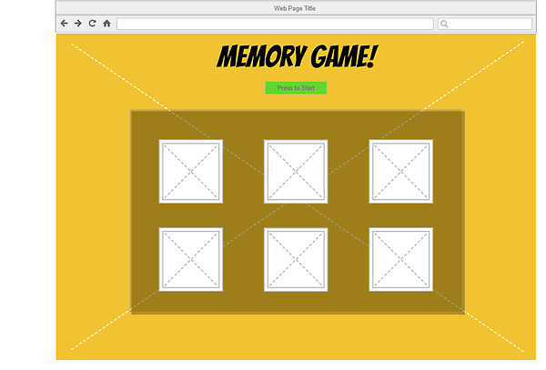
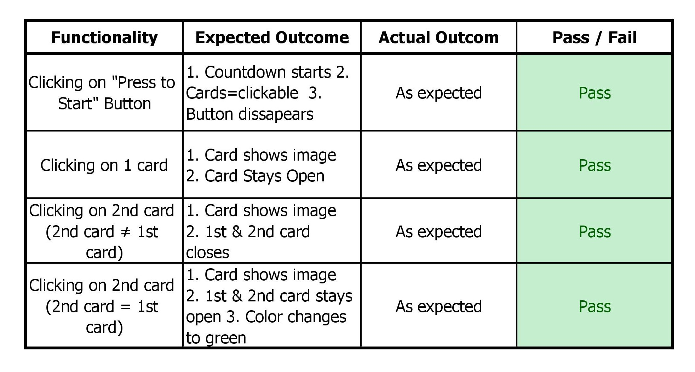
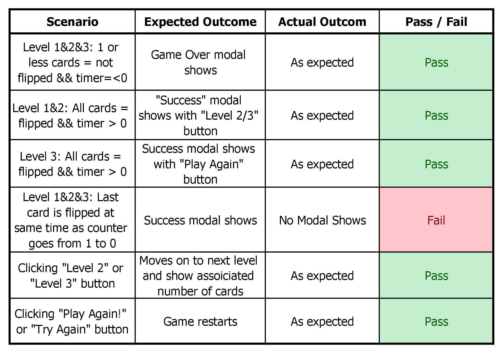

# Mistery Memory Game - User Centric Milestone Project #

### Project Info ### 
My goal is to make a Memory Game. The plan is to make it in 3 stages(/pages) with a different difficulty level on each (Easy, Medium and Hard). You play the game by clicking on a card, the card will flip to show a picture of a mysterious creature. This creature got a matching pair, so the users goal is to find its match. If a match is made, the 2 clicked cards will stay open. If the 2 clicked cards doesn't match, the cards will flip back over. If you manage to match all available cards, within a certain time-period and click-count, the user will move on to the next stage. If not, it's Game Over/Restart.    

### UX ###

The main UX goal with the game and website, is to capture the visitors interest and give them an urge to play and complete the game. I want the game to look fun and easy to play, and self-explanatory at first glance. This with the combination of colors and effects, and exctincting the cards and game itself from the background and the rest of the layout. 
  
#### User Stories: ####

1.	As a visitor looking for a fun way to spend some time, I'm looking for a fun activity.  

2.	As a visitor who wants to take a short break from the duties I got in my life, I am looking for a game that can take my mind of things.

3.	As a visitor looking for a challenge for my memory, I'm looking for a fun way to do this.                 

#### Strategy ####

I wanted to make a website that would capture the visitors attention at a first glance, and from there get the urge to play, and complete the game.

#### Scope ####

A simple and self-explanatory layout, with "fun" colors and distinctive cards.

#### Structure ####

Firstly, I decided on the structure for the card layout, with the goal to keep it simple. A heading, some kind of Start Button, a timer and the cards. Early on I decided to go with different difficulty stages/levels and that the first level would contain 6 cards with 3 pairs. The theme for the game = mystery and magic. 

#### Skeleton ####

#### Surface ####

I wanted the surface to represent mystery and fun. I wanted the user to be curious of what would show when clicking on the cards. While google:ing around, looking for inspiration, I came over Dreamworks animated movie-series "How To Train Your Dragon", and decided to make my game around that. Post-poning my thinking about copyrights and just went online to find pictures to put into my project, I later on decided to change the theme for my game.

### Features ###

#### Existing Features ####

-    "Press to Start" button: a button that lets you play the game. Enables click-function on cards and starts the timer.  
-	Timer: a countdown timer that goes from 30-0seconds on each level. If you reach 0s = Game Over. 
-	Card Flipper: the function that makes it possible to turn the side of the cards when you click them. 
-	Modals: shows when you reach different parts of the game. Totally 3 (Next Level, Game Over and Game Complete).

#### Features Left to Implement ####

In the future:
- I would like to store the time it took for the user to finish the game, and then display it to the user.
- I would like to add more stages and difficulty level. 
- I would like to add and store how many "Card-Flipps" the user did to complete the game, and then display it to the user.

### Technologies Used ###

-	HTML
-	CSS
-	Bootstrap 4.1.0: https://getbootstrap.com/
-	Javascript
-    jQuery
-	Pixabay: https://pixabay.com/ (for all images in the game)
-	Gliffy: https://go.gliffy.com/ (for wireframe)

### Testing ###

##### General Testing #####

##### Testing Scenarios #####

##### Testing Responsiveness #####
The code and website have been tested through-out a number of different Browsers (Chrome, Firefox, Explorer) and on a number of different devices via Google Chromes Developer Tools, to check responsiveness (different mobile devices like Iphone & Samsung Galaxy, Ipad, etc.) 

##### Testing User Stories #####
Since all of my User Stories are, in the end, a matter of taste, I have a difficulty of proving that they where fully accomplished. On the 5 different persons who tried the game, they all found it both fun and at first try somewhat challenging. 

### Errors/Problems ### 

1 (noticed) error has not yet been fixed due to time-schedule. If you, at the exact same time as the countdown timer goes from 1s - 0s, clicks on the last correct card, no modal will show. This is the same on all levels.     

### Deployment ###

The website is hosted using Github pages. To check out the live website, follow this link: https://antonisaksson.github.io/mystery-memory/
### Acknowledgements ###

Inspiration was taken from this youtube tutorial: https://www.youtube.com/watch?v=Eq4bUSWGv1Y

### Content ###

Text is written by myself.

### Media ###

All pictures is taken from https://pixabay.com/